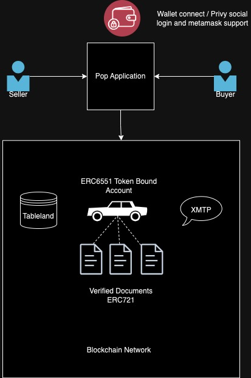

## Proof Of Purchase - [Pop Application](https://pop-wheat.vercel.app/)

Welcome to Pop! We offer a seamless decentralized marketplace platform for buying and selling cars using the power of blockchain.

### Features

- **Token Bound Accounts (TBA):** Each car is represented by a unique ERC6551 token bound account, ensuring the authenticity and traceability of the vehicle.
- **Document Verification:** Any verified document related to the car can be associated as minted ERC721 tokens held under its TBA. This guarantees the transparency and authenticity of every car's history and details.
- **XMTP Messaging:** Our integration with the XMTP blockchain messaging library allows buyers and sellers to communicate directly, ensuring a smooth transaction process.
- **Bidding System:** Fancy a car? Place a bid and get a chance to own it! Our transparent bidding system ensures fair market competition.
- **AI Integration:** Just snap a picture of your car and let our AI API identify details about it! No more manual hassles.

### How It Works

1. **Listing a Car**

- Capture a photo of your car using your phone.
- Our AI API processes the image and identifies the car's make, model, year, and other specifications.
- Enter any additional details or information about the car.
- Upload and verify essential documents related to the car.
- Once satisfied, mint the car's data as a TBA, and it's now listed on the marketplace.

2. **Buying a Car**

- Browse the listings and select a car of your interest.
- Check out its associated documents, ensuring the car's authenticity and condition.
- Use the XMTP messaging system to communicate with the seller, ask questions, or negotiate prices.
  Place a bid or buy the car directly.

3. **Completing the Transaction**

- Once a deal is reached, the car's ownership (TBA) is transferred to the buyer upon successful transaction.
- All details of the transaction are stored on the blockchain, ensuring transparency and security.

## Contracts on Scroll Network

[ERC6551 Car Contract](https://blockscout.scroll.io/address/0xF8b68956c8636C05f3D2F184Ce2B1719A30fb494)
[ERC721 Service Record Contract](https://blockscout.scroll.io/address/0x70993A5438c3dd991D508f8FBAB33C0164d3Ed18)
[ERC721 Road Worthy Record Contract](https://blockscout.scroll.io/address/0x6C8D494BeA4310c9e01f7F2C291a0035f4d93F6A)

## Contracts on Mantle Network

[ERC6551 Car Contract](https://explorer.mantle.xyz/address/0xf7a8a843B9fE1179A3172770a157B2913fb4cf27)
[ERC721 Service Record Contract](https://explorer.mantle.xyz/address/0x70993A5438c3dd991D508f8FBAB33C0164d3Ed18)
[ERC721 Road Worthy Record Contract](https://explorer.mantle.xyz/address/0x6C8D494BeA4310c9e01f7F2C291a0035f4d93F6A)

## License

This project is licensed under the MIT License - see the LICENSE.md file for details.

## Contact

If you have questions or need further information, please open an issue or contact the maintainers directly.
